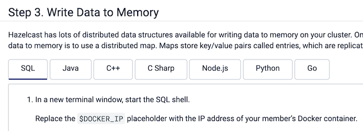

= Contributing to Hazelcast Docs
:url-node: https://nodejs.org/en/download/
:url-imdg-docs: https://github.com/hazelcast/imdg-docs
:url-antora-yml: https://docs.antora.org/antora/2.3/component-version-descriptor
:url-antora-local-content: https://docs.antora.org/antora/2.3/playbook/content-source-url/#local-urls
:url-readme: ../README.adoc
:half-width: role=half-width
:toc: preamble

The Hazelcast docs are open source, and we welcome your contributions!

[[get-started]]
== Get Started

This section helps you get started with your first contribution.

=== Step 1. Install Dependencies

Antora requires an active long term support (LTS) release of Node.js. To check if you have Node.js installed, do the following:

```bash
node --version
```

If you see an active Node.js LTS version on your device, you’re ready to build the docs.

If no version number is displayed in the output, you need to {url-node}[install Node.js].

=== Step 2. Clone a documentation project

Documentation is hosted in xref:{url-readme}#documentation-content[separate GitHub repositories]. To work on a particular documentation project, you must fork it, clone it, and configure the `antora-playbook-local.yml` file to process your local version.

NOTE: You can find all content repositories in the `antora-playbook.yml` file under `content.sources`.

For example, to build the IMDG reference manual on your local device:

. Fork the {url-imdg-docs}[`imdg-docs` repository].

. Clone your forked repository, and check out the branch that you want to work on.
+
[source,bash]
----
git clone https://github.com/<your-username>/imdg-docs
cd imdg-docs
----

=== Step 3. Make your Changes

After installing the dependencies and cloning a documentation project, you're ready to make your changes.

. Make your changes to the documentation in your local branch
TIP: See the <<structure, Docs Structure section>> for help navigating a documentation project.

. Check the files that you changed.
+
[source,bash]
----
git status
----

=== Step 4. Build and Test your Changes Locally

When working on a documentation project, you should build and preview the docs on your local machine to see your changes before going live.

. Run the local build script.
+
[source,bash]
----
npm i
npm run-script build-local
----
+
NOTE: This script is defined in the `package.json` file, and runs Antora with the `antora-playbook-local.yml` file.
+
In the `test` folder you will now have all the webpages for your documentation component.
+
NOTE: This script builds the documentation only for your local branch. If you want to build the whole site, you can run the script from the `hazelcast-docs` repository.

. To view the documentation site from a localhost web server, run the `serve` script.
+
[source,bash]
----
npm run-script serve
----
+
Then on the same device, go to the "Local" address shown after you run the `serve` command above, to view the local site. Usually it is `http://localhost:3000`.
+

. If you want to show others your changes, you can expose your web server to the Internet. While the terminal in which you run `npm run-script serve` is open, open another terminal and run the following command:
+
```bash
ngrok http http://localhost:3000 (assuming the the local address is http://localhost:3000; if a different one is assigned after the `serve` command, use that one here)
```
+
The public URL is displayed in the output of the above command, which you can share with colleagues to show your changes on the preferred browsers:
+
image::../images/ngrok.png[ngrok output]

When you've finished viewing your changes, use **CTRL-C** to stop the server.

=== Step 5. Send us your Changes

After making your changes, and testing how they look, you're ready to send them to us for review.

. Stage your changes for commit.
+
[source,bash]
----
git add <filename>
----

. Commit your changes.
+
[source,bash]
----
git commit -m "Concise message that describes your changes"
----

. Push your local branch to your remote fork.

. In the GitHub UI, go to your forked repository and open a pull request in the documentation project that you forked.

Thanks! We'll review your changes and provide feedback and guidance as necessary.

== Docs structure

All documentation projects are organized according to the same content hierarchy.

[source,bash]
----
antora.yml <1>
modules/ <2>
  ROOT/ <3>
    attachments/ <4>
    examples/ <5>
    images/ <6>
    pages/ <7>
    partials/ <8>
    nav.adoc <9>
  another-module/ <10>
----
<1> This file tells Antora that the contents of the `modules/` folder should be processed and added to the documentation site. This file is called the {url-antora-yml}[component version descriptor file].
<2> This folder contains the content that Antora will process
<3> This folder contains any content that can't be categorized under a specific module name. Unlike other modules, the name of this module is never displayed in the URL of the site.
<4> In any module, this folder contains downloadable content such as ZIP files that a user can download through a link.
<5> In any module, this folder contains examples such as source code that you can include in Asciidoc pages.
<6> In any module, this folder contains images that you can include in Asciidoc pages.
<7> In any module, this folder contains the Asciidoc pages that make up the documentation project.
<8> In any module, this folder contains Asciidoc snippets such as warnings or copyright material that you can include in any Asciidoc pages.
<9> In any module, this file contains a list of links that will become part of the left-hand navigation menu.
<10> This folder is an example of how you can include any number of named modules to use to categorize your content. All modules follow the same structure as ROOT. Unlike the ROOT module, the names of other modules are included in the URL of the site. For example a page named `example.adoc` inside the `pages/` folder of the `example` module will have the following path: `example/example.adoc`

[[local-builds]]
== Build the whole site locally

Sometimes, you may want to build the whole documentation site instead of just a single component. For example, if you want to check that links to other components are working.

. Clone this repository.
+
[source,bash]
----
git clone https://github.com/hazelcast/hazelcast-docs
cd hazelcast-docs
----

. Open the `antora-playbook-local.yml` file.

. Point the content source that you are working on to your local changes. For example, if you are working on the Cloud documentation in a local folder called `cloud-docs`, replace the cloud content source with the following:
+
[source,yaml]
----
- url: ../path-to-local-cloud-docs
  branches: HEAD
  start_path: docs
----
+
For more information about using local content, see the link:{url-antora-local-content}[Antora documentation].

. Run the local build script.
+
[source,bash]
----
npm i
npm run-script build-local
----
NOTE: This script is defined in the `package.json` file, and runs Antora with the `antora-playbook-local.yml` file.
+
In the `docs` folder you will now have all the webpages for your documentation component.

. To view the documentation site from a localhost web server, run the `serve` script.
+
[source,bash]
----
npm run-script serve
----
+
Then on the same device, go to `http:localhost:5000` to view the local site.
+

. If you want to show others your changes, you can expose your web server to the Internet, using ngrok by doing the following:
+
```bash
npm run-script expose
```
+
The public URL is displayed in the output:
+
image::../images/ngrok.png[ngrok output]

When you've finished viewing your changes, use **CTRL-C** to stop the server.

[[tabs]]
== Tabbed Blocks

Asciidoctor comes with a feature to produce tabbed blocks in the HTML output. See the example:



The syntax to be used in the source Asciidoc files is as follows.

[,asciidoc]
----
[tabs]
====
Tab A:: Contents of tab A.

Tab B::
+
Contents of tab B.

Tab C::
+
--
Contents of tab C.

Contains more than one block.
--
====
----

* You can use the usual https://docs.asciidoctor.org/asciidoc/latest/verbatim/callouts/[Callouts] feature for the tabbed blocks.
* You can provide links to a specific tab in a tabbed block.
** Click on a specific tab and get the ID of its `a` tag using the "Inspect Element" developer tool:
+
image::../images/tab-id.png[{half-width}]
** Use this ID as the anchor when giving a https://docs.asciidoctor.org/asciidoc/latest/macros/xref/[link/cross-reference].


