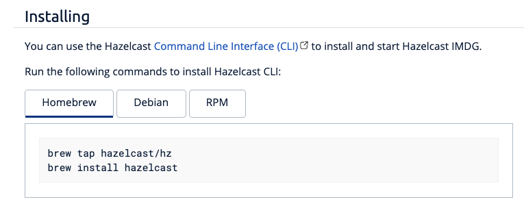
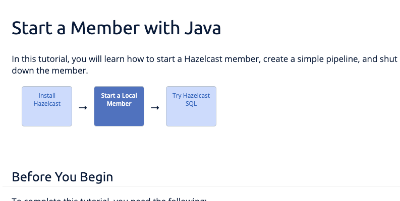

= Hazelcast Style Guide
:url-asciidoc-reference: https://docs.asciidoctor.org/asciidoc/latest/syntax-quick-reference/
:url-github-docs-ui: https://github.com/hazelcast/hazelcast-docs-ui
:icons: font

This document is a reference for anyone who is writing content for the Hazelcast documentation site.

If you are creating or editing content, please follow our style guide to help us do the following:

- Offer documentation in a standard format.
- Make our documentation straightforward to read for non-native English readers.
- Make sure that our documentation educates our readers.

If you have a question about writing that we don't cover in this guide, feel free to open an issue.

== Writing Tools

We recommend using a code editor that supports markdown files, for example Visual Studio Code with the markdown Lint extension.

== Asciidoc Markup

We write in Asciidoc. If you have never used Asciidoc before, we recommend the link:{url-asciidoc-reference}[Asciidoc Syntax Quick Reference]. 

As well as the default markup, we use the following:

- An extension to allow you to add tabbed code samples.
- A custom HTML template for workflow maps.

=== Tabs

Tabs reduce the cognitive load on users by allowing them to select the content that they want to read.

To create tabs, use the following Asciidoc syntax:

[source]
....
[tabs] 
==== 
Tab Title:: 
+ 
--
Tab content
--
Next Tab Title:: 
+ 
--
Next tab content
--
====
....

For example, you could document XML and YAML configurations, using the following tabs.

[source]
....
[tabs] 
==== 
XML:: 
+ 
-- 
[source,xml]
----
<hazelcast-client>
    ...
    <instance-name>barClient</instance-name>
    <client-labels>
        <label>user</label>
        <label>bar</label>
    </client-labels>
    ....
</hazelcast-client>
----
--

YAML::
+
[source,yaml]
----
hazelcast-client:
  instance-name: barClient
  client-labels:
    - user
    - bar
----
====
....

=== Workflow Maps

Workflow maps give users the big picture of a tutorial or task by showing them where they are in a series of steps.

. To create a new workflow map, you need to add the following HTML to the top of each page that is part of the workflow:
+
[source,html]
----

  
<a href="install-hazelcast.html"> <1>
    
Label of the first box
</a> <2>
  

  
↓
 <3>
  
<a href="get-started-docker.html">
    
Another box
</a>
  

  
↓

  
<a href="learn-sql.html">
    
Another box
</a>
  

----
+
<1> Add a link to each box that goes to an HTML page.
+
<2> Label each box and make sure to increment the box number in the `box` class.
+
<3> Add an arrow to separate each box.

. Add a page attribute to each page in the workflow to specify which box number it is for.
+
For example, for box1, the page attribute would be `:page-box-number: 1`.
+
NOTE: This attribute is used to highlight the box when the user is on the page.

== UK or US English?

We always write in US English. See the following examples:

- Words ending in -er, -re:
+
British: centre, fibre
+
American: center, fiber

- Words ending in -our, -or:
+
British: colour, behaviour, neighbour
+
American: color, behavior, neighbor

- Words ending in -ise, -ize, -yse, -yze:
+
British: analyse, initialise, serialise, organise
+
American: analyze, initialize, serialize, organize

- Words ending in a vowel followed by the letter "l":
+
British: travelling, cancelling
+
American: traveling, canceling

- Words ending in -ence, -ense:
+
British: licence, defence
+
American: license, defense

== General Advice

You should help readers find information easily. Try to offer a simple and uncluttered presentation.

- Keep sentences simple. If a sentence is very long, consider breaking it into shorter sentences. If you have to gasp for breath after reading the whole sentence, it is probably too long.
  ** Not Good: Aggregation operations are implemented, as mentioned above, on top of the MapReduce framework and therefore all operations can be achieved using pure map-reduce calls but using the Aggregation feature is more convenient for a big set of standard operations.
  ** Good: Aggregation operations are implemented on top of the MapReduce framework. Therefore, all operations can be achieved using pure map-reduce calls. However, using the Aggregation feature is more convenient for a big set of standard operations.

- Paragraphs should cover one topic at a time. Separate a subject and its supportive phrases into a separate paragraph. Placing a white space between paragraphs helps readers see the information in each paragraph as a unit.

- When writing text, do not exceed 130 characters per line. Use a single line break. These line breaks are ignored on AsciiDoc (if not specified differently), but line breaks make it easier and readable/fixable for others to edit the text.

- Link as much as possible internally in the documents to make navigation easy for readers.

== Writing Headings

Headings should describe what a page is about in as few words as possible.

When writing heading, keep the following points in mind:

- Capitalize the first letter in each word of the heading.
  ** Not Good:
+
[source,asciidoc]
----
5.1 Starting the instance and client
----

  ** Good:
+
[source,asciidoc]
----
5.1 Starting the Instance and Client
----

- Do not create two headings with no body text between them.
  ** Not Good:
+
[source,asciidoc]
----
3. Release Notes
3.1 New Features
----

  ** Good: 
+
[source,asciidoc]
----
3. Release Notes

This chapter lists the new features and improvements developed and bugs fixed for this release.

3.1 New Features
----

- If a section of text goes on for a while, such as over a page break, break it up with some headings.

- In our current solution, if you change an existing heading, you need to change every link tag in the documentation that points to that heading. Be careful if you change a heading--you could break links!

- In the source text, put two new lines before a heading and one new line after it. The tools/generators ignore those spaces, but it enables a good reading experience while in the editor.

== Writing Lists

Lists help to break up long text and highlight important points.

- The sentence before the list should end with a period or a colon, not a semicolon.

- Capitalize the first word in each listed item, unless doing so is visually awkward.

- Use periods or other ending punctuation when the listed items are complete sentences.

- Avoid commas or semicolons following items and do not use the conjunction and before the last item in a list.

- Use numbered lists to indicate sequence or rank.
+
[source,asciidoc]
----
To start your car, perform the following steps.
. Sit in your car's driver seat, facing forward.
. Shut the door.
. Fasten your seat belt.
. Make sure the car is in PARK.
. Put the key in the ignition.
. Turn the key until the car starts.
----

- Use bullets when you do not wish to indicate rank or sequence.

- Definition lists are lists that define terms, usually programming terms. Make the term being defined monospace, and then capitalize the first word of the definition. Say “Number of” to indicate a count or total, use “Time in (time unit)” to indicate time. For example:
  ** `timeoutMillis`: Time in milliseconds a transaction will hold a lock. Defaults to 2 minutes.

  ** `durability`: Number of backups for the transaction log. Defaults to 1.

== Numerals or Words

When writing numbers, use the following guidelines to decide whether to write them as words or numerals.

- Write numbers from zero through ten as words, and write numbers above ten as numerals. For example:
+
[source,asciidoc]
----
There were three members in the cluster.

They start 150 Hazelcast instances every second.
----

- Write numbers as words if they begin a sentence even if they would otherwise be written as numerals. If spelling out such a number seems awkward, rewrite the sentence so that the number does not appear at the beginning.
+
[source,asciidoc]
----
One hundred and fifty Hazelcast instances are started every second.
----

- Write approximate and round numbers as words.
+
[source,asciidoc]
----
We have had more than a thousand issues for this release.
----

- Write small ordinal numbers which express degree or sequence in words: first, second; but 27th, 42nd.

- Indicate the plural of numerals by adding -s without apostrophes. Form the plural of a written number like any noun: elevens, sixes, twenties.

- Express time periods as numerals: 5 seconds, 100 milliseconds.

- Generally give percentages as numerals and write out the word percent: Approximately 85 percent of the swap space is left. However, in a table, use a numeral followed by the percent symbol.

- Chapter or section numbers may appear as numerals or words, but be consistent.
Use a comma to separate numbers with four or more digits into groups of three, starting from the right: 1,000 members.

== Displaying Code

When documenting code, you can add it to the page in two ways:

- Inline
- Block

To write inline code, use backticks (``).

To write block code, use the following syntax:

[source]
....
[source,language] <1>
----
code goes here
----
....

<1> Replace the `language` placeholder with the programming language that you are writing in. For a list of available languages, see the highlighter code in the link:{url-github-docs-ui}//blob/master/src/js/vendor/highlight.bundle.js[hazelcast-docs-ui repository].

NOTE: When documenting objects or methods that belong to a class, prefix them with the canonical classname for the first use.
