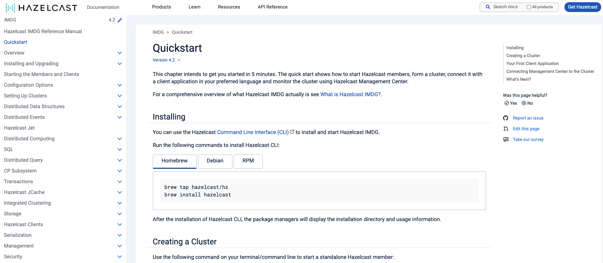
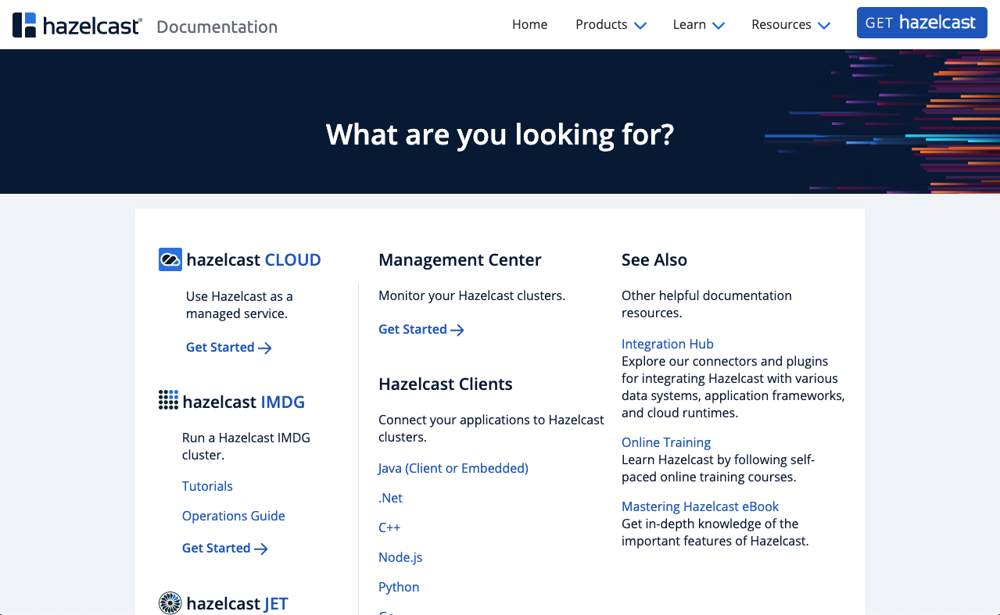

= Hazelcast Documentation Site
:url-imdg-docs: https://github.com/hazelcast/imdg-docs
:url-mc-docs: https://github.com/hazelcast/mc-docs
:url-antora: https://docs.antora.org/antora/2.3/
:url-docs-ui: https://github.com/hazelcast/hazelcast-docs-ui
:url-asciidoc-extensions: https://asciidoctor-docs.netlify.app/asciidoctor.js/latest/extend/extensions
:url-contributing: .github/CONTRIBUTING.adoc
:url-netlify: https://netlify.com/
:url-netlify-docs: https://docs.netlify.com/
:url-production: https://docs.hazelcast.com
:url-staging: https://develop--laughing-jepsen-c9f089.netlify.app


image:https://img.shields.io/github/workflow/status/JakeSCahill/hazelcast-docs/Index%20site?label=Indexer[GitHub Workflow Status]
image:https://api.netlify.com/api/v1/badges/77888641-0e64-4263-8155-1e0e0b50e74e/deploy-status[Netlify deploy status]
image:https://img.shields.io/badge/Build-Production-blue[link="{url-production}"]
image:https://img.shields.io/badge/Build-Staging-yellow[link="{url-staging}"]

This repository hosts an {url-antora}[Antora] playbook project for the Hazelcast documentation site.



== Work in progress

The roadmap for this site includes the following items:

- [ ] Migrate Hazelcast Cloud content
- [ ] Migrate Jet content
- [x] Migrate Management Center content
- [ ] Review and restructure content, starting with IMDG

== Introduction to Antora

Antora is a static site generator that facilitates a docs-as-code workflow where documentation is stored in Git repositories and processed to output a static website.

Documentation can be stored in one or more repositories and/or branches.

Antora uses Asciidoctor.js to convert Asciidoc to HTML, then it uses Handlebars to set that HTML into a page layout.

NOTE: The page layouts and UI code (css, JavaScript, Handlebars templates) is stored in a {url-docs-ui}[separate repository], which outputs a `ui-bundle.zip` file that this project references in the playbook.

video::BAJ8F7yQz64[youtube]

== The playbook

The playbook defines the content sources (repositories and branches), site URL, UI bundle URL, global AsciiDoc attributes, and Asciidoctor extensions.

This project has two playbook files, which configure the build process for the documentation site:

- `antora-playbook-local.yml`: link:{url-contributing}#local-builds[For local builds]
- `antora-playbook.yml`: For production builds

The current playbooks pull from the following content sources:

- The `master`, `archive`, and all `v` branches of the {url-imdg-docs}[`imdg-docs` repository] and the {url-mc-docs}[`mc-docs` repository]
- The `home/` folder in this repository, which contains an Antora component for the home page

[[home]]
== Home Component

The `home/` folder in this repository contains the Home documentation component. The source code for the home page is in the `body-home.hbs` template of the {url-docs-ui}[`hazelcast-docs-ui` repository].



== Custom Asciidoctor Extensions
The custom extension in the `lib/` directory processes the Asciidoc `tabs` blocks to generate tabbed code samples in the output HTML.

For more information about writing Asciidoctor.js extensions, see the {url-asciidoc-extensions}[Asciidoctor docs].

== Production and Staging Sites

The documentation site is hosted on {url-netlify}[Netlify], which builds two versions of the site from this GitHub repository:

- {url-production}[Production site]: This site is hosted on {url-production} and is built from the `main` branch
- {url-staging}[Staging site]: This site is hosted on {url-staging} and is built from the `develop` branch

To preview changes, all pull requests are made to the `develop` branch. When the team are happy with the changes, the `develop` branch is merged into the `main` branch to deploy the changes to the production site.

== GitHub Actions

To automate some elements of the build process, this repository includes the following GitHub Actions:

.GitHub Actions
[cols="m,a,a"]
|===
|File |Description |Triggers

|index-site.yml
|Runs the Docsearch indexer in a Docker container to index the site and send the index to Algolia
|Once per day at 00:00 UTC
|===

As well as these actions, repositories that are listed under the `content.sources` field in the `antora-playbook.yml` file also include GitHub actions to trigger builds of the staging site.

```yaml
content:
  sources: 
  - url: https://github.com/hazelcast/imdg-docs
    branches: [master, v*]
    start_path: docs
```

Whenever content in the repository's listed branches are changed, the GitHub Action sends a {url-netlify-docs}/configure-builds/build-hooks/[build hook] to Netlify to trigger a new build of the staging site.

For an example of these GitHub Actions, see the {url-imdg-docs}[IMDG documentation repository].

== Contributing

To learn how to use the playbook and generate the docs site locally, see our link:{url-contributing}[contributing guide].
